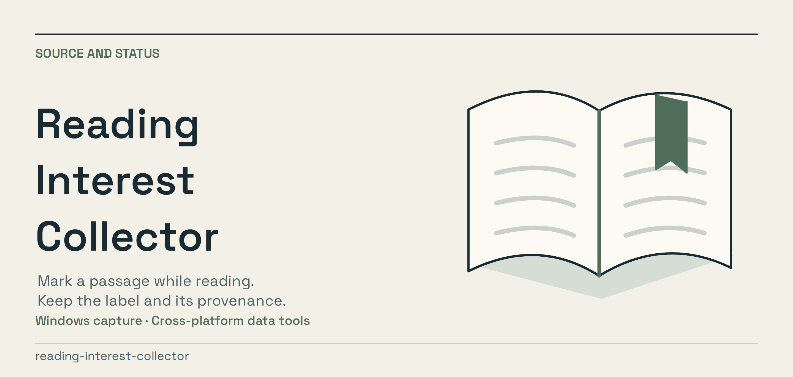
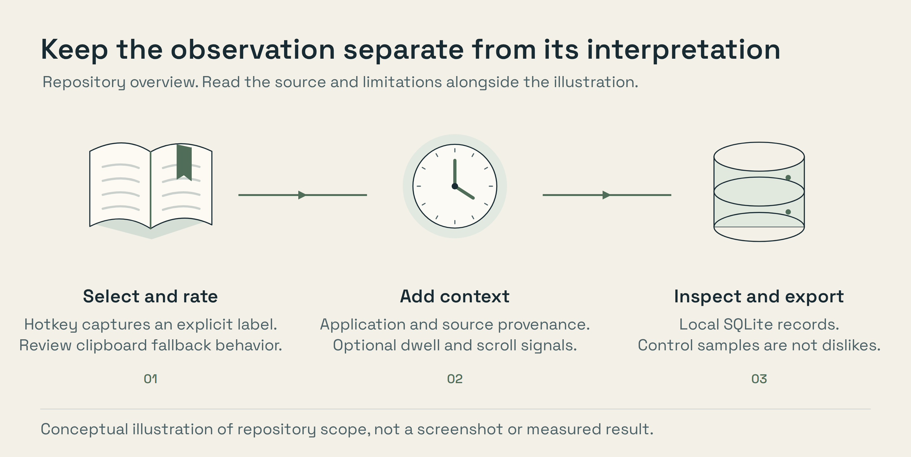

<p align="center"><a href="assets/presentation/banner.png"></a></p>

# Reading Interest Collector

A Windows background collector for labelled reading passages. Select text,
press a configured hotkey, and keep the rating with application and document
provenance in SQLite. Cross-platform commands inspect and export the records.

It also includes optional behavioral sampling. Those signals need careful
interpretation: a stable selection is not eye tracking, and an unlabelled
passage is not proof of disinterest. This repository collects observations;
it does not contain a trained recommendation or preference model.

The database may include private passages, local paths, URLs and window titles.
Review capture settings, use it only in your own reading environment, and
sanitize records before sharing. Clipboard restoration and app-specific
provenance are best-effort integrations, not universal guarantees.

[](assets/presentation/overview.png)

## Core interaction

Works across SumatraPDF, browsers, EPUB readers, text files - anything with
selectable text. No need to open Hermes or paste anything.

```
select text → press one key → continue reading
```

Default hotkeys (edit in config):

| Hotkey       | Rating            |
|--------------|-------------------|
| Ctrl+Alt+1   | very_interesting  |
| Ctrl+Alt+2   | interesting       |
| Ctrl+Alt+3   | already_knew      |
| Ctrl+Alt+4   | uninteresting     |
| Ctrl+Alt+5   | research          |

## How capture works

On a hotkey press, the collector:

1. Reads the **foreground window** (app + title) via Win32.
2. Enriches provenance through a small **app adapter**:
   - **SumatraPDF** → document path, page number (best-effort via UI Automation)
   - **Browser** (Chrome/Edge/Firefox/Brave) → URL (best-effort from address
     bar) + page title
   - **Generic** → app name + window title
3. Grabs the **selected text**: tries the UI Automation `TextPattern` first,
   then falls back to simulating `Ctrl+C`, reading the clipboard, and **restoring
   your original clipboard** when the integration succeeds.
4. Writes one row to SQLite.

## Behavioral signals (dwell + scroll-back)

The explicit ratings are the highest-quality signal, but passive telemetry is a
first-class part of the dataset. A `BehaviorWatcher` runs in the background and,
every `behavior.sample_seconds`, samples where you are. It computes a
`position_hash` (SHA-1 of the current selection, or of source+page+url), so it
estimates how long the sampled selection or source position remained unchanged. It does not measure gaze or prove which word you read:

- **dwell_s** - seconds the same position was held before you moved on.
- **scroll_backs** - wheel-up events (scrolling *back up* to re-read), counted
  by a Windows low-level mouse hook while a reading app is foreground.

Stay on a position past `dwell_seconds_min` (or scroll back at all) and a
`dwell` row is written. When you press a **highlight hotkey**, the current
dwell + scroll-back counts are attached to that explicit labelled row - so every
highlight carries how long you were looking at it before you labelled it.

Sampling reads the selection through UI Automation only (no simulated Ctrl+C),
so passive tracking never steals your clipboard or disrupts reading.

A separate sampler thread writes `control_sample` rows every N minutes while
you're in a reading app - provenance for passages you saw but didn't label, so
you get negative/neutral examples rather than a dataset of only things you liked.

## Record format

Same shape regardless of app (example rows):

```json
{"kind":"highlight","rating":"very_interesting","app":"SumatraPDF",
 "source":"C:\\Books\\book.pdf","page":183,"selected_text":"...",
 "dwell_s":12,"scroll_backs":3,"ts":"2026-08-13T07:18:49+00:00"}

{"kind":"dwell","app":"SumatraPDF","source":"C:\\Books\\book.pdf","page":184,
 "selected_text":"...","dwell_s":40,"scroll_backs":2,"ts":"..."}

{"kind":"highlight","rating":"interesting","app":"browser",
 "source":"https://example.com/article","url":"https://example.com/article",
 "title":"An Article","selected_text":"...","ts":"..."}

{"kind":"control_sample","app":"chrome","source":"https://example.com/other",
 "ts":"..."}
```

## Install & run (Windows)

```powershell
powershell -ExecutionPolicy Bypass -File scripts\install.ps1   # venv + deps + default config
powershell -ExecutionPolicy Bypass -File scripts\run.ps1       # launch hidden daemon
```

Requirements (auto-installed): `pynput`, `pywin32`, `uiautomation`, and optional
`pymupdf` for richer PDF context recovery.

Config lives at `%USERPROFILE%\.reading-collector\config.json` (hotkeys, adapters,
sampler interval, db path).

## Inspect / export

Cross-platform CLI (run from Hermes or anywhere Python works):

```bash
python scripts/manage.py stats                 # totals per rating
python scripts/manage.py recent                # last rows
python scripts/manage.py search "keyword"      # grep the dataset
python scripts/manage.py context 42            # recover surrounding text of row 42
python scripts/manage.py ratings               # current hotkey map

python exports/export.py --format jsonl --out dataset.jsonl  # json | jsonl | csv
```

`context` recovers the surrounding paragraph from a **local** PDF/text file
using the stored `source` + `page`, without storing whole documents at log time
(only the selected passage is saved).

## Project layout

```
collector/            the Windows daemon
  main.py             entry; wires hotkeys, capture, behavior, sampler
  capture.py          foreground window + selection capture (UIA → clipboard)
  adapters.py         SumatraPDF / browser / generic adapters
  clipboard.py        clipboard read + restore-safe Ctrl+C fallback
  behavior.py         dwell-time tracking + scroll-back (passive telemetry core)
  mousehook.py        Windows LL mouse hook counting wheel-up (scroll-back)
  sampler.py          control-sample thread (negative/neutral examples)
  datastore.py        SQLite schema + inserts   (cross-platform)
  config.py           JSON config               (cross-platform)
  context.py          recover surrounding context from local files (cross-platform)
exports/export.py     export to json / jsonl / csv (cross-platform)
scripts/              install.ps1, run.ps1, manage.py
tests/                stdlib unittest suite (runs on Linux too)
```

## Design notes / V1 scope

- **Lightweight log**: only the selected passage + source id are stored. Full
  context is recovered on demand later from the local file, never at log time.
- **Raw observations preserved**: no reduction into an interest profile.
- **Passive telemetry is included**: dwell time, scroll-back (reread), and
  control samples give the implicit signals alongside explicit ratings. Farther
  signals (copy events, keyboard-driven re-scroll) are still out of scope.
- **Untested portability**: the cross-platform core (datastore, config, export,
  context, sampler, behavior-watcher logic) is unit-tested here on Linux. The
  Windows capture layer (Win32/UIA/clipboard/hotkeys) and the LL mouse hook are
  written defensively but have **not been exercised on a real Windows desktop**
  from this environment - follow the smoke-test step below to verify on your
  machine.

## Quick smoke test (verify capture works on your Windows box)

```powershell
# 1. run the daemon, then select text in SumatraPDF or a browser
python -m collector.main --check                 # prints config + db path
# 2. select a sentence, press Ctrl+Alt+1
# 3. confirm the row landed:
python scripts\manage.py recent
```

## License

MIT

## Illustration sources

The figures explain the repository’s scope; they are not captured product
screens or benchmark results. Editable sources and rendering instructions are
in [scripts/artwork](scripts/artwork/README.md).
